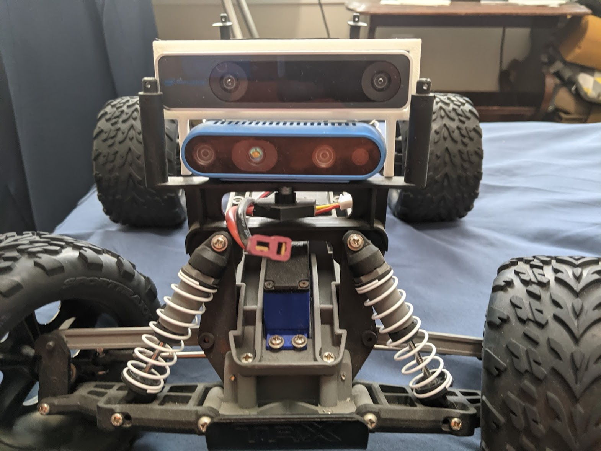
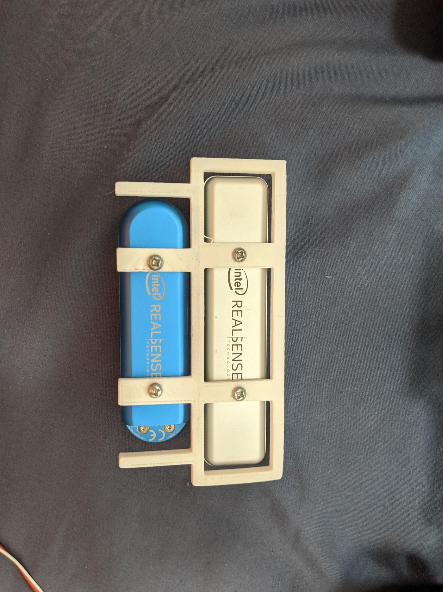
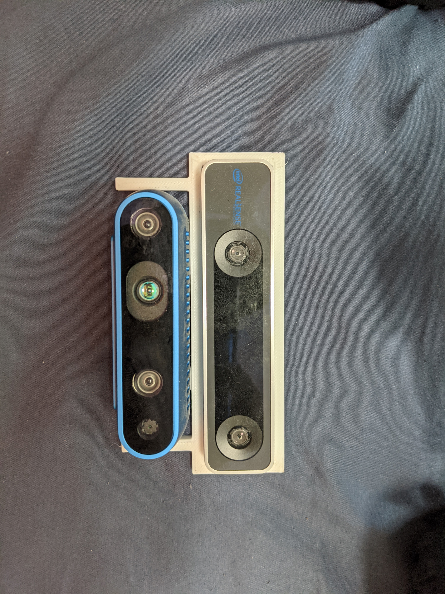
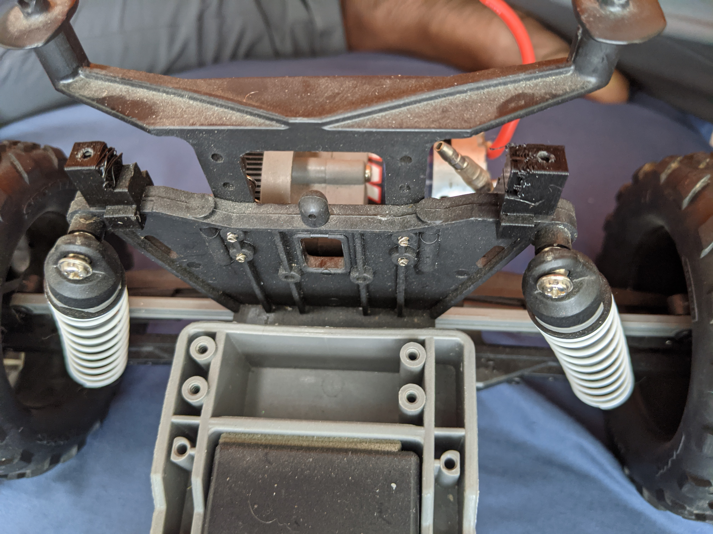
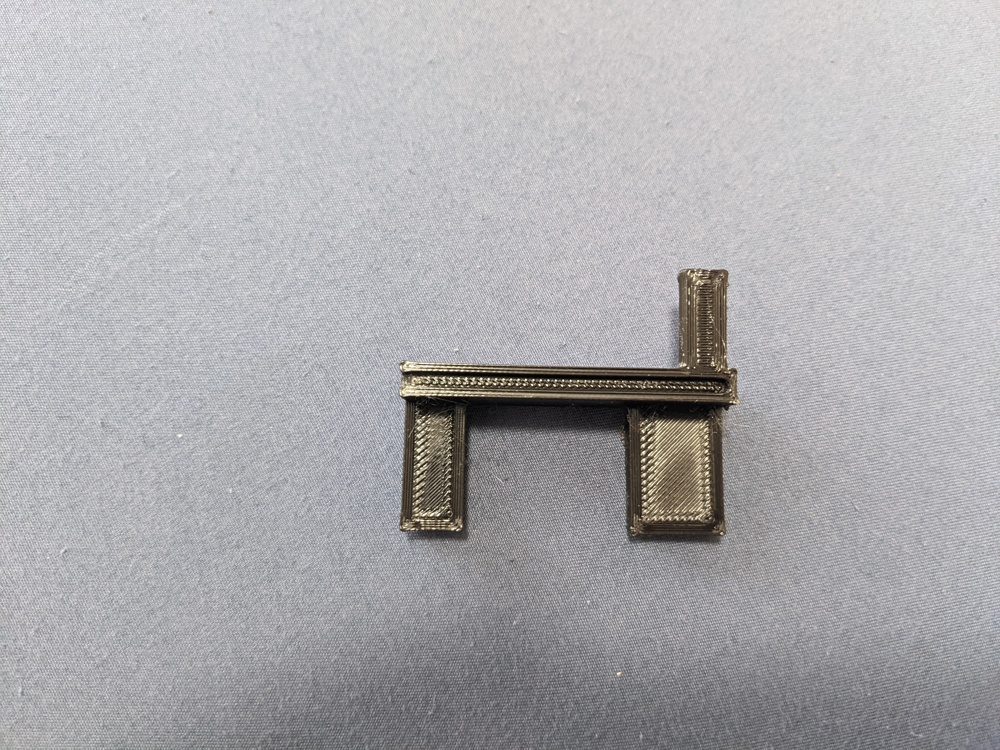
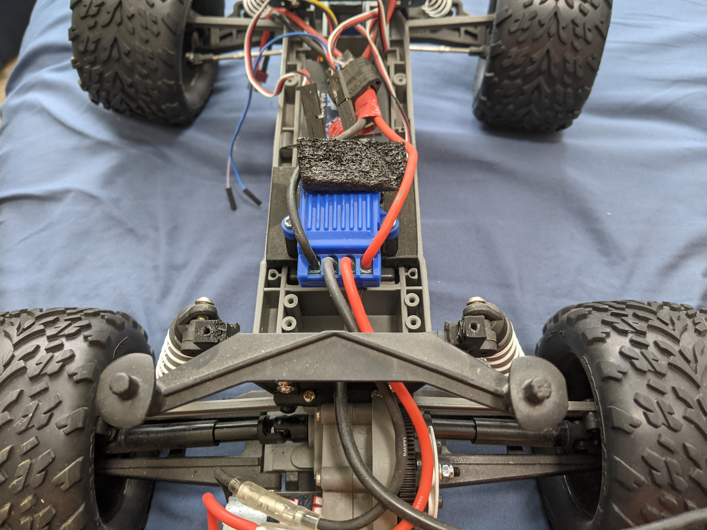
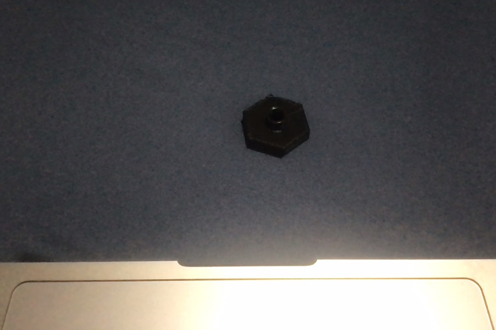
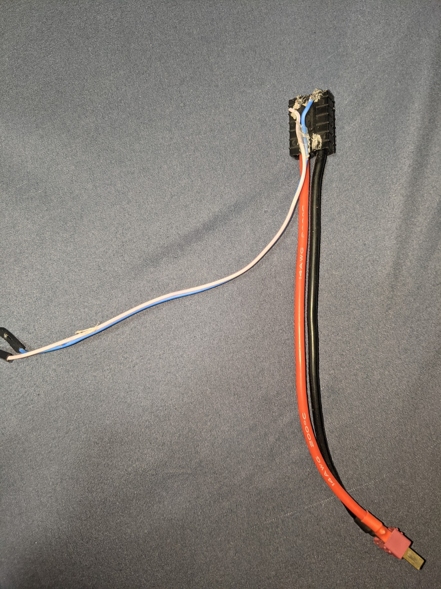

<div align="center">



# Morgan State University’s School of Engineering
## MSU RACECAR V1


# Table of contents
</div>

1. [Introduction](#intro)
2. [The Build Construction](#paragraph1)
   1. Bill of Materials
   2. Computing Modules (?)
   3. Camera(s)
   4. Wi-Fi
   5. Assembly Hardware
3. Hardware Setup
   1. 3D Printed Parts
   2. Wiring
4. The Software Setup
   1. ROS
   2. Arduino
   3. Bluetooth
5. Startup
   1. Manual
   2. Autonomous

## Introduction <a name="intro"></a>
Morgan State University is attempting to delve into the world of Artificial Intelligence. This project is meant to act as a jumping off point for a future endeavors and build a platform that students can learn from and build upon.


## The Build Construction <a name="intro"></a>

### Bill of Materials <a name="intro"></a>

This section lists the parts needed to build the MSU RACECAR. After you have received the parts and confirmed them, proceed to the hardware setup. Some of the parts are 3D printed. In these cases, the STL files have been made available along with recommended print settings.

```Disclaimer: Most of the URLs are from the OEM. You can probably find it cheaper elsewhere, e.g. Amazon.```

### Computing Modules (?) <a name="intro"></a>
||||||
|---|---|---|---|---|
|Part | Quantity | Cost | URL | Note |
|Jetson Nano|1|$99.00|https://www.nvidia.com/en-us/autonomous-machines/jetson-store/#jetson-nano|The 2GB version is also |
|Arduino Micro|1|$32.00|https://store.arduino.cc/usa/arduino-micro|Generic Version will work also|
|HC-06 Bluetooth Module|1|$11.00|https://www.amazon.com/Wireless-Bluetooth-Receiver-Transceiver-Transmitter/dp/B01MQKX7VP/ref=asc_df_B01MQKX7VP/?tag=hyprod-20&linkCode=df0&hvadid=167146065113&hvpos=&hvnetw=g&hvrand=16656197411905567539&hvpone=&hvptwo=&hvqmt=&hvdev=c&hvdvcmdl=&hvlocint=&hvlocphy=1027158&hvtargid=pla-362748457327&psc=1|Generic Version will work also|

### Camera(s) <a name="intro"></a>
||||||
|---|---|---|---|---|
|Part | Quantity | Cost | URL | Note |
|INTEL D435|1|$179.00|https://store.intelrealsense.com/buy-intel-realsense-depth-camera-d435.html?cid=sem&source=sa360&campid=2021_q1_egi_us_ntgrs_nach_revs_text-link_brand_bmm_desk_realsense-shopping-ad_o-2fj5v_google&ad_group=RealSense+Shopping+Ads&intel_term=PRODUCT_GROUP&sa360id=92700050119513696&gclid=CjwKCAiAjeSABhAPEiwAqfxURflhmEFdvpKcQLn3MmvM4kGXbQuXrnXNFoWgEWSZqakCRxl8dq7sDRoCzKAQAvD_BwE&gclsrc=aw.ds||
|INTEL T265|1|$199.00|https://store.intelrealsense.com/buy-intel-realsense-tracking-camera-t265.html?cid=sem&source=sa360&campid=2021_q1_egi_us_ntgrs_nach_revs_text-link_brand_bmm_desk_realsense-shopping-ad_o-2fj5v_google&ad_group=RealSense+Shopping+Ads&intel_term=PRODUCT_GROUP&sa360id=92700050119513705&gclid=CjwKCAiAjeSABhAPEiwAqfxURTS6hqR8Fg53Ss-XBovh-1NOrRv66u4cPTb46CTJMK7m4en5JObQYhoCp7oQAvD_BwE&gclsrc=aw.ds||

### Wi-Fi <a name="intro"></a>
||||||
|---|---|---|---|---|
|Part | Quantity | Cost | URL | Note |
|TL-WN722N|1|$16.99|https://www.tp-link.com/us/home-networking/usb-adapter/tl-wn722n/||
|USB Hub|1|$12.99|https://www.amazon.com/Anker-Extended-MacBook-Surface-Notebook/dp/B07L32B9C2/ref=asc_df_B07L32B9C2/?tag=hyprod-20&linkCode=df0&hvadid=320048880417&hvpos=&hvnetw=g&hvrand=1424088810660995306&hvpone=&hvptwo=&hvqmt=&hvdev=c&hvdvcmdl=&hvlocint=&hvlocphy=1027158&hvtargid=pla-621842602315&psc=1&tag=&ref=&adgrpid=61389685902&hvpone=&hvptwo=&hvadid=320048880417&hvpos=&hvnetw=g&hvrand=1424088810660995306&hvqmt=&hvdev=c&hvdvcmdl=&hvlocint=&hvlocphy=1027158&hvtargid=pla-621842602315||
### Assembly Hardware + Misc <a name="intro"></a>
||||||
|---|---|---|---|---|
|Part | Quantity | Cost | URL | Note |
|Chassis|1|$275|| Purchasing a different chassis may make some of the 3-D printed parts unusable|
|M3 x 6 Machine Screws|4||||
|M5 x 6 Machine Screws|1||||
|20 x 40 Perfboard|1|$3|||
|LM2596 DC-DC Buck Converter Step Down Module|1|14.95|https://www.amazon.com/LM2596-Converter-Module-Supply-1-23V-30V/dp/B008BHBEE0|The actual individual part is much cheaper but is often sold only in packs of 5-10|
## Hardware Setup
### 3D Printed Parts 
```All Parts where 3D printed on an Ender 3```
||||||
|---|---|---|---|---|
| Image(s) | Purpose | Supports Needed | Layer Height | Printspeed |
||Acts as a mount for the 2 3D Sensing Cameras|No|.28mm| 150mm/s|
||Screws into the rear underside of the Jetson nano, while the front side rests on a piece of foam on top of the ESC|Yes|.28mm| 150mm/s|
||Screws into the body of the ESC and attaches to the sides of the arduinos perf board|Yes|.28mm| 150mm/s|
||Acts to extend the head of a Nmm bolt ```A small hole must be drilled in the frame for the bolt to pass through```|No|.28mm| 150mm/s|
### Wiring



In order to simplify powering the nano I chose to pull power from the RC battery to a LM2596 as shown above. 


Connect the Arduino micro and the HC-06 as defined above if the references aren't clear in the photos, the pin definitions can be found at the top of the arduino [script](src/roboguide/arduino/src/src.ino)

## Software Setup
### ROS
#### Method 1: 
   Follow the basic instructions to install Ubuntu 16.04. This requires an at least 16 GB SD card so have one on hand before starting. 
   Once that process is complete, finish by installing ROS melodic with the provided instructions.
#### Method 2: 
   Install from the JetsonHacksNano repo. https://github.com/JetsonHacksNano/installROS

``` Only the base version is necessary but if you would like to use the GUI tools like rviz in my experience they will run fine.```

Once ROS is installed. Install these ROS package dependencies
```
sudo apt-get install \ 
ros-melodic-usb-cam \
ros-melodic-joy \
ros-melodic-joy-teleop-twist \
ros-melodic-compressed-image-transport 
ros-melodic-openni-launch \
ros-melodic-rosserial-arduino \ 
ros-melodic-rosserial \
ros-melodic-slam-gmapping 
```

Librealsense is also necessary for using the realsense camera package. Some of the documentation says that it is installed by default but that hasn't worked in my case so I recommend you follow this [tutorial](https://github.com/IntelRealSense/librealsense) to install it separately.

```You can test this installation using the realsense-viewer command```

After the dependencies have been installed and you cloned this repository as a package into your workspace as described [here](http://wiki.ros.org/catkin/Tutorials/create_a_workspace) run the catkin_make command and run ```source /devel/setup.bash```
### Arduino
After which you should clone the git repo into the root of your device. Running the ```./setup.sh``` installation script in the GitHub will install additional dependencies for ROS. Run ```ls /dev/tty*``` to find which port your arduino is attached on. cd into [Moonbear/src/roboguide/arduino/](src/roboguide/arduino/) and run ```ino build; ino upload -p ${port}```

### Bluetooth
Just install the Joy Bluetooth Commander from the play store and pair to the HC-06 device within the app by moving the joystick. 

## Startup
For either mode it's necessary to power the computer since there is no on or off switch manually plugging and unplugging the RC battery cable is the best way to go about turning the system on and off.

```Though this didn't raise issues during development you should shut down the nano separately via SSH first```
### Manual 
Turning on the setup without connecting **Bluetooth Mode Jumper** will startup the car in bluetooth mode. Then launch the App and start driving.
### Autonomous 
 In a new terminal run ```roslaunch rc.launch``` to run the ROS control. After it succesfully connects to the arduino run ```roslaunch mapping.launch``` on either the host machine to run exploration and mapping of the area. The car will stop running when it runs out of search areas
## Bugs