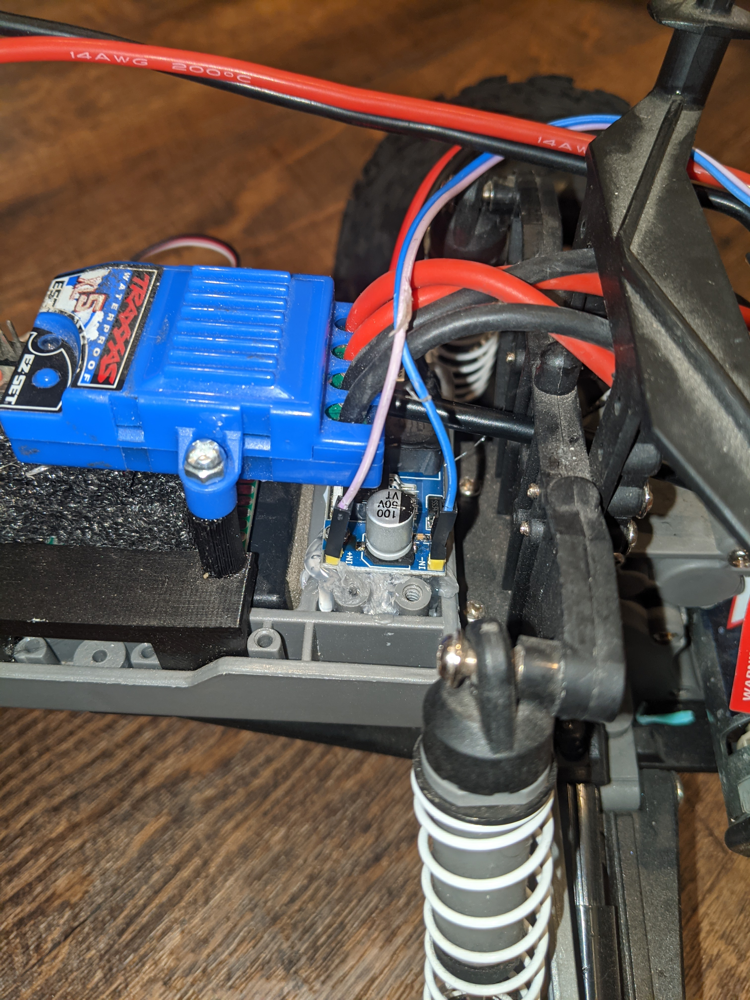
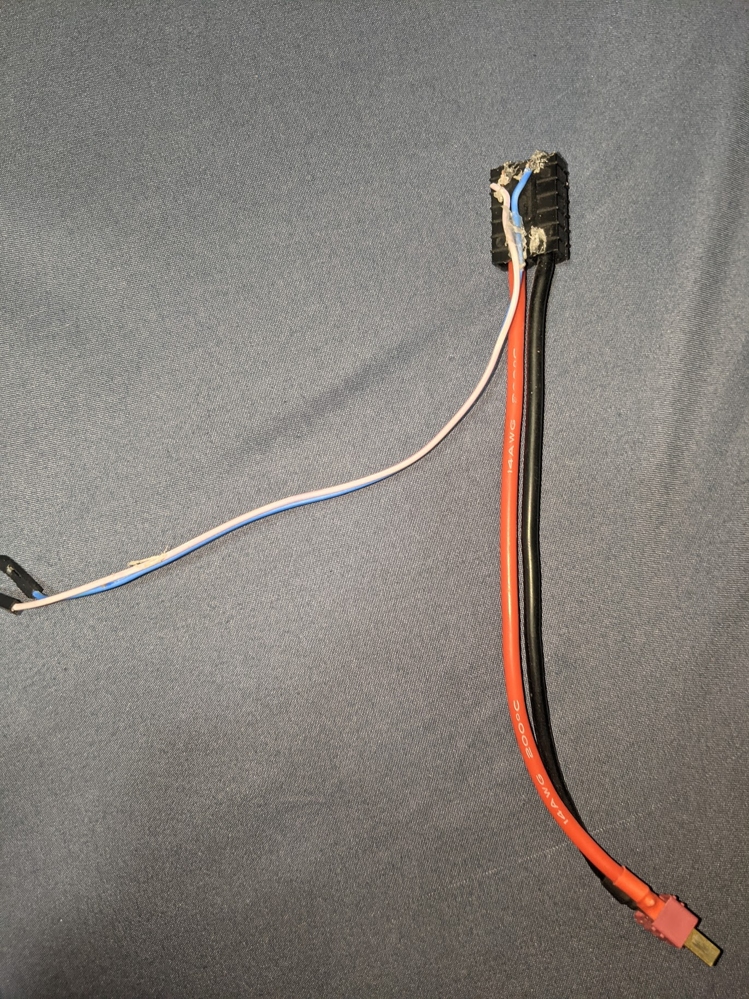
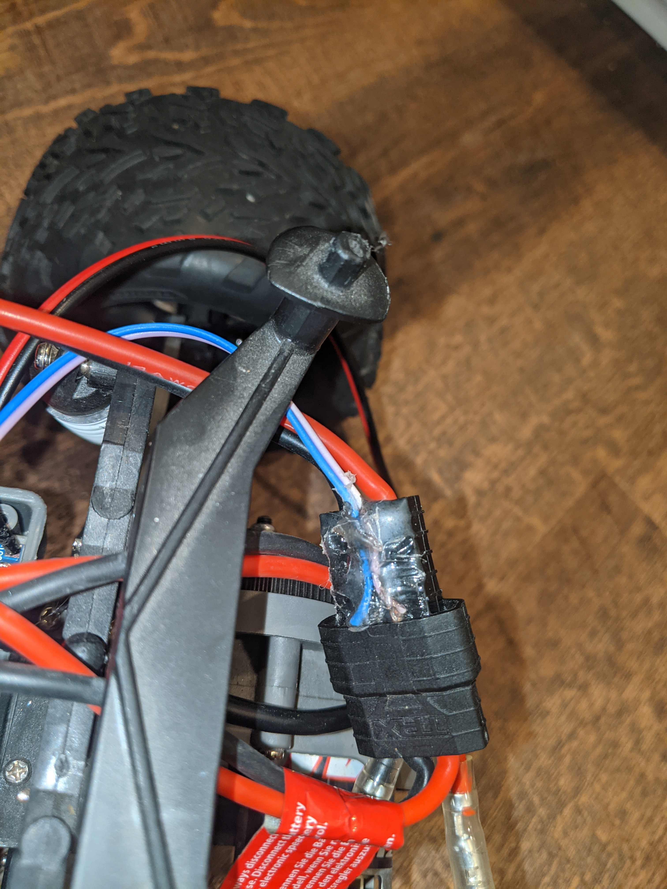
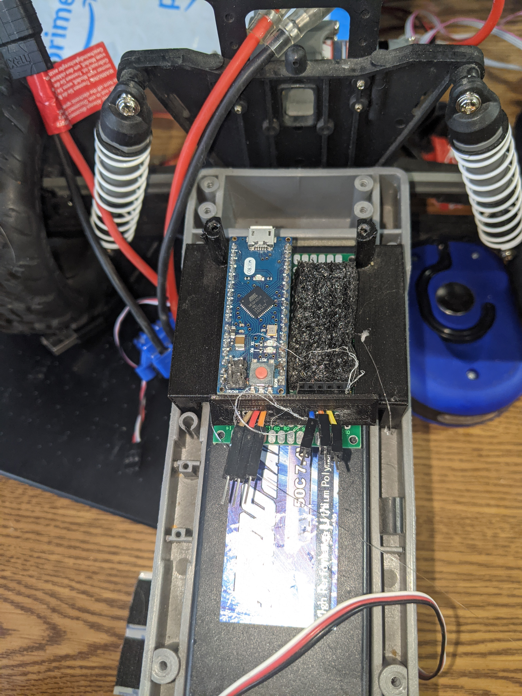
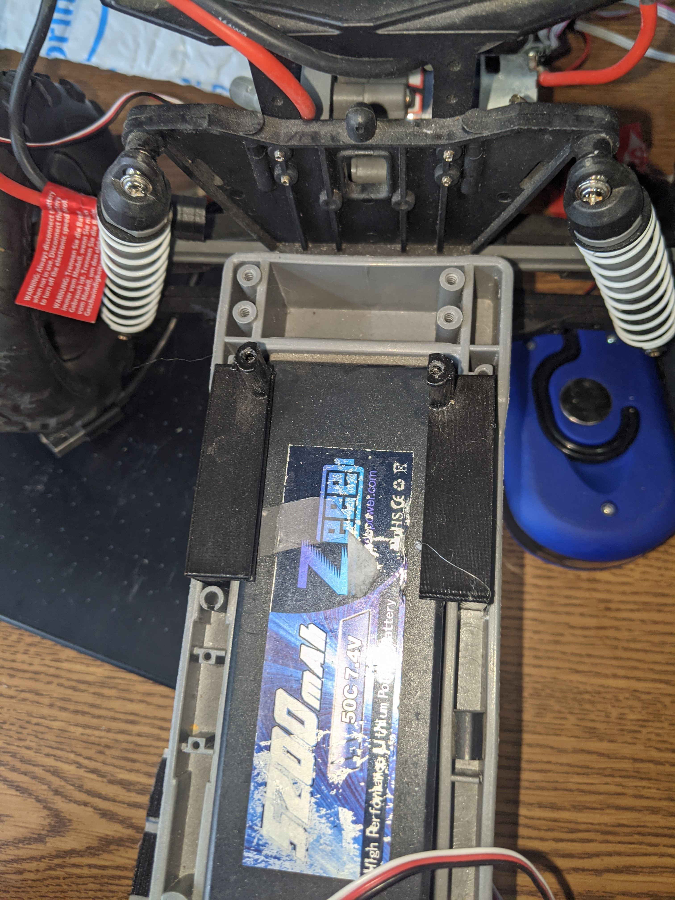

<div align="center">


# Morgan State University’s School of Engineering
## MSU RACECAR V1


# Table of contents
</div>

1. [Introduction](#intro)
2. [The Build Construction](#paragraph1)
   1. Bill of Materials
   2. Computing Modules (?)
   3. Camera(s)
   4. Wi-Fi
   5. Assembly Hardware
3. Hardware Setup
   1. 3D Printed Parts
   2. Wiring
4. The Software Setup
   1. ROS
   2. Arduino
   3. Bluetooth
5. Startup
   1. Manual
   2. Autonomous

## Introduction <a name="intro"></a>
Morgan State University is attempting to delve into the world of Artificial Intelligence. This project is meant to act as a jumping off point for a future endeavors and build a platform that students can learn from and build upon.


## The Build Construction <a name="intro"></a>

### Bill of Materials <a name="intro"></a>

This section lists the parts needed to build the MSU RACECAR. After you have received the parts and confirmed them, proceed to the hardware setup. Some of the parts are 3D printed. In these cases, the STL files have been made available along with recommended print settings.

```Disclaimer: Most of the URLs are from the OEM. You can probably find it cheaper elsewhere, e.g. Amazon.```

### Computing Modules (?) <a name="intro"></a>
|                        |          |        |                                                                                                                                                                                                                                                                                                                |                                |
| ---------------------- | -------- | ------ | -------------------------------------------------------------------------------------------------------------------------------------------------------------------------------------------------------------------------------------------------------------------------------------------------------------- | ------------------------------ |
| Part                   | Quantity | Cost   | URL                                                                                                                                                                                                                                                                                                            | Note                           |
| Jetson Nano            | 1        | $99.00 | https://www.nvidia.com/en-us/autonomous-machines/jetson-store/#jetson-Nano                                                                                                                                                                                                                                     | The 2GB version is also        |
| Arduino Micro          | 1        | $32.00 | https://store.arduino.cc/usa/arduino-micro                                                                                                                                                                                                                                                                     | Generic Version will work also |
### Camera(s) <a name="intro"></a>
|            |          |         |                                                                                                                                                                                                                                                                                                                                                                                                           |      |
| ---------- | -------- | ------- | --------------------------------------------------------------------------------------------------------------------------------------------------------------------------------------------------------------------------------------------------------------------------------------------------------------------------------------------------------------------------------------------------------- | ---- |
| Part       | Quantity | Cost    | URL                                                                                                                                                                                                                                                                                                                                                                                                       | Note |
| INTEL D435 | 1        | $179.00 | https://store.intelrealsense.com/buy-intel-realsense-depth-camera-d435.html?cid=sem&source=sa360&campid=2021_q1_egi_us_ntgrs_nach_revs_text-link_brand_bmm_desk_realsense-shopping-ad_o-2fj5v_google&ad_group=RealSense+Shopping+Ads&intel_term=PRODUCT_GROUP&sa360id=92700050119513696&gclid=CjwKCAiAjeSABhAPEiwAqfxURflhmEFdvpKcQLn3MmvM4kGXbQuXrnXNFoWgEWSZqakCRxl8dq7sDRoCzKAQAvD_BwE&gclsrc=aw.ds    |      |
| INTEL T265 | 1        | $199.00 | https://store.intelrealsense.com/buy-intel-realsense-tracking-camera-t265.html?cid=sem&source=sa360&campid=2021_q1_egi_us_ntgrs_nach_revs_text-link_brand_bmm_desk_realsense-shopping-ad_o-2fj5v_google&ad_group=RealSense+Shopping+Ads&intel_term=PRODUCT_GROUP&sa360id=92700050119513705&gclid=CjwKCAiAjeSABhAPEiwAqfxURTS6hqR8Fg53Ss-XBovh-1NOrRv66u4cPTb46CTJMK7m4en5JObQYhoCp7oQAvD_BwE&gclsrc=aw.ds |      |

### Wi-Fi <a name="intro"></a>
|           |          |        |                                                                                                                                                                                                                                                                                                                                                                                                                                                                                              |      |
| --------- | -------- | ------ | -------------------------------------------------------------------------------------------------------------------------------------------------------------------------------------------------------------------------------------------------------------------------------------------------------------------------------------------------------------------------------------------------------------------------------------------------------------------------------------------- | ---- |
| Part      | Quantity | Cost   | URL                                                                                                                                                                                                                                                                                                                                                                                                                                                                                          | Note |
| TL-WN722N | 1        | $16.99 | https://www.tp-link.com/us/home-networking/usb-adapter/tl-wn722n/                                                                                                                                                                                                                                                                                                                                                                                                                            |      |
| USB Hub   | 1        | $12.99 | https://www.amazon.com/Anker-Extended-MacBook-Surface-Notebook/dp/B07L32B9C2/ref=asc_df_B07L32B9C2/?tag=hyprod-20&linkCode=df0&hvadid=320048880417&hvpos=&hvnetw=g&hvrand=1424088810660995306&hvpone=&hvptwo=&hvqmt=&hvdev=c&hvdvcmdl=&hvlocint=&hvlocphy=1027158&hvtargid=pla-621842602315&psc=1&tag=&ref=&adgrpid=61389685902&hvpone=&hvptwo=&hvadid=320048880417&hvpos=&hvnetw=g&hvrand=1424088810660995306&hvqmt=&hvdev=c&hvdvcmdl=&hvlocint=&hvlocphy=1027158&hvtargid=pla-621842602315 |      |
### Assembly Hardware + Misc <a name="intro"></a>
|                                              |          |       |                                                                               |                                                                                    |
| -------------------------------------------- | -------- | ----- | ----------------------------------------------------------------------------- | ---------------------------------------------------------------------------------- |
| Part                                         | Quantity | Cost  | URL                                                                           | Note                                                                               |
| Chassis                                      | 1        | $275  |                                                                               | Purchasing a different chassis may make some of the 3-D printed parts unusable     |
| M3 x 6 Machine Screws                        | 4        |       |                                                                               |                                                                                    |
| M5 x 6 Machine Screws                        | 1        |       |                                                                               |                                                                                    |
| 20 x 40 Perfboard                            | 1        | $3    |                                                                               |                                                                                    |
| LM2596 DC-DC Buck Converter Step Down Module | 1        | 14.95 | https://www.amazon.com/LM2596-Converter-Module-Supply-1-23V-30V/dp/B008BHBEE0 | The actual individual part is much cheaper but is often sold only in packs of 5-10 |

## Hardware Setup

### 3D Printed Parts

```All Parts where 3D printed on an Ender 3```
|                                                                                             |                                                                                                                                                                                |                 |              |            |
| ------------------------------------------------------------------------------------------- | ------------------------------------------------------------------------------------------------------------------------------------------------------------------------------ | --------------- | ------------ | ---------- |
| Image(s)                                                                                    | Purpose                                                                                                                                                                        | Supports Needed | Layer Height | Printspeed |
|  | Acts as a mount for the 2 3D Sensing Cameras. This piece is screwed directly into the front frame of the car as shown in pictures                                              | No              | .28mm        | 150mm/s    |
|                                                | Screws into the rear underside of the Jetson Nano, while the front side rests on a piece of foam on top of the ESC                                                             | Yes             | .28mm        | 150mm/s    |
|  | Screws into the body of the ESC and attaches to the sides of the arduinos perf board. These pieces are designed specifically for this frame and should slide in place as shown | Yes             | .28mm        | 150mm/s    |
|                                              | Acts to extend the head of a 5mm bolt ```A small hole must be drilled in the frame for the bolt to pass through```                                                             | No              | .28mm        | 150mm/s    |


### Construction 
#### Power



In order to power the Jetson Nano we pull power from the RC battery into a Buck Convertor (LM2596) as shown above.
This drops the batteries 7V to a useable 5V. In order to use this with the Jetson Nano, first solder the positive and negative leads of a cut micro USB cable to the output of the LM2596.

   ``` For reference these are the two outer most pins you can check which is positive by connecting both to a multimeter and seeing when the voltage reading is positive ``` 

   Then solder a male header pin in each of the input holes of the device. 

   ```If spare header pins are not available, These can be soldered directly to the board but I find it very convenient to be able to move dangling parts as the design changes.```

   In order to actually connect the convertor to power you'll need to tap into wire somewhere. And our particular case we have an adapter that connects the dean connecter of the battery to the ______ connector for the ESC. By thinly soldering two cables to the output of that adapter it remains usable but also allows us to connect to the header pins we connected earlier.

```A small dab of hot glue at the end of the head can stop the wires from moving around. There's no need to add as much as I did, it makes it harder to plug in```




   Once the leads are soldered and connected to the Voltage convertor. Disconnect the micro usb cable from the Nano and connect the deans connector to the battery. Using a multimeter probe the output pins of the device while turning the blue potentiometer until the output voltage is 5.3 V. Once that's done connect to the Nano and confirm that it boots.

   ```If at this point you plug it in and it doesn't turn on check that the black jumper above the other power connector has been removed. Also the Nano does have built in overvoltage protection so if the input voltage is slightly too high it simply won't turn on```

### Arduino

For the step you're going to need a piece of 20 x 40 Proto board. Solder two female header pin strips on the board lengthwise such that the arduino can slide into them.

```Add Header Photo```



```In earlier version of this had two boards used here which is why you see the extra female that are connected above the blue wire. Ignore it here```

Both the ESC and steering are treated as servos so we'll need to wire male connectors to the Arduino in order to control them.

Connect two of the wires to power. and two of the wires to ground. Connect one wire to pin 9 of the adruino for steering. Connect the second wire to pin 12 of the adruino for the esc. 

```I highly recommend keeping these in groups of 3 with tape or something, just to remember which ones are which because it's impossible to see when the board is slid into place```


Take the 2 L shaped pieces you 3D printed earlier And place them into the groves next to the battery as shown above. The pieces will only slide in smoothly when in their correct position
## Software Setup

### General

* Install Ubuntu on the Jetson Nano. https://developer.nvidia.com/embedded/learn/get-started-jetson-Nano-devkit
* Install general dependancies...

```sudo apt-get install git arduino```
* In order to properly use the real sense cameras you'll need to install the drivers for them seperately. luckily this process has ben mostly automated here.
### ROS

* Installing ROS melodic with one of the methods below.

#### Method 1

* Follow the instructions to install ROS Melodic Desktop. http://wiki.ros.org/melodic/Installation/Ubuntu

#### Method 2

* Install from the JetsonHacksNano repo. https://github.com/JetsonHacksNano/installROS

```Only the base version is necessary but if you would like to use the GUI tools like rviz in my experience they will run fine.```

Once ROS is installed. Install these ROS package dependencies

``` sudo apt-get install \
ros-melodic-realsense2-camera \
ros-melodic-joy \
ros-melodic-joy-teleop-twist \
ros-melodic-rosserial-arduino \
ros-melodic-rosserial \
ros-melodic-slam-gmapping \
ros-melodic-amcl \
ros-melodic-move-base \
ros-melodic-teb-local-planner \
ros-melodic-robot-upstart \
ros-melodic-pointcloud-to-laserscan
```

```Librealsense is necessary for using the **realsense2-camera** package. Some of the documentation says that it is installed by default but that hasn't worked in my case so I recommend you follow this [tutorial](https://github.com/IntelRealSense/librealsense) to install it separately.```

After the dependencies have been installed clone this repository into your ```workspace/src``` folder as a package and run ```catkin_make;source /devel/setup.bash```

A tutorial on how to make a ROS workspace can be found [here](http://wiki.ros.org/catkin/Tutorials/create_a_workspace)

### Arduino

* After plugging in your Arduino, run ```ls /dev/tty*``` to find which port your arduino is attached on.
* cd into [arduino/](arduino/) and run ```ino build; ino upload -p ${port}```. This uploads the script to your arduino board.
* Connect the ```SteeringControlPin```(Pin 9 by default) to the control line for the steering servo.
* Connect the ```ThrottleControlPin```(Pin 12 by default) to the control line for the blue ESC.

### Bluetooth

Just install the Joy Bluetooth Commander from the play store and pair to the HC-06 device within the app by moving the joystick.

## Startup

For either mode it's necessary to power the computer since there is no on or off switch manually plugging and unplugging the RC battery cable is the best way to go about turning the system on and off.

```Though this didn't raise issues during development you should shut down the Nano separately via SSH first```

### Manual

Turning on the setup without connecting **Bluetooth Mode Jumper** will startup the car in bluetooth mode. Then launch the app and start driving.

### Autonomous

 In a new terminal run ```roslaunch rc.launch``` to run the ROS control. After it succesfully connects to the arduino run ```roslaunch mapping.launch``` on either the host machine to run exploration and mapping of the area. The car will stop running when it runs out of search areas

### Sanity Checks

#### librealsense

* Once librealsense is installed properly you should be able to run the realsense-viewer command in terminal. This will bring up a window that allows you to view the data coming from either camera.
* If you're getting a ```[No Realsense devices found]``` error when the device is plugged in check that the udev rules were installed properly. This can be as simple as unplugging and plugging the camera back in.

#### ROS Nodes

* In order to check that all of the notes are launching properly first look at the output of the Ross launch command for info.
* If that doesn't work running the command ```rqt_graph``` will open up a window showing you which notes are sending data to which subscribers.


#### Arduino ```WARN: Remove the wheels or prop up before testing```

In order to check that the Arduino is connected and set up properly connect pin 11 to 5v. This will launch the car and serial control mode. By opening up a serial monitor and connecting to the port you found earlier you should be able to send commands directly to the car through this.

* Sending ```T25``` should set the throttle to 25% of the max throttle. 
* Sending ```S90``` should set the steering wheels to 90 degrees aka straight forward.

#### ESC

In order to drive the ESC needs to be *armed* basically the input throttle should hold at 50% for a few seconds. This is indicated by the blinking green light turning a solid green.